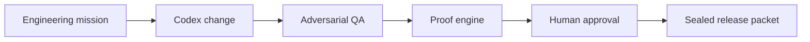

# ShipProof Architecture

## Product boundary

ShipProof is an evidence-native release verifier for AI-generated code. It does not claim that a model's confidence makes code safe. It derives a release verdict from executable checks, content-addressed artifacts, explicit gates, and human approval.

## Evidence model

| Artifact | Purpose | Verification |
|---|---|---|
| Requirement | Declares expected behavior | Contract gate |
| Implementation | The change being evaluated | SHA-256 content hash |
| Adversarial test | Attempts to violate the requirement | Executed test result |
| Approval | Preserves consequential human control | Explicit UI gate |
| Release packet | Portable decision record | SHA-256 packet seal |

## Runtime paths

The hosted UI presents a deterministic five-stage narrative: Contract, Build, Adversarial QA, Approval, and Release. The deterministic mode makes judging reliable and does not require an API key.

`npm run verify:demo` runs the adversarial suite, counts pass/fail results, hashes configured evidence files, and writes a sealed JSON packet. A failed test produces failed gates and a non-zero process exit.

## Trust properties

- **Fail closed:** failed verification never produces a PASS gate.
- **Content addressed:** implementation and test evidence use SHA-256.
- **Human controlled:** automated checks cannot self-approve release.
- **Truthful telemetry:** unavailable model usage is recorded as `NOT_AVAILABLE`, never invented.
- **Judge reproducible:** no API key is required for the deterministic demo or verification CLI.

## Current scope

The Build Week slice proves the release-evidence contract using a login rate-limiter mission. Repository ingestion, arbitrary test-runner adapters, organization policy packs, and signed remote attestations are future extensions.
